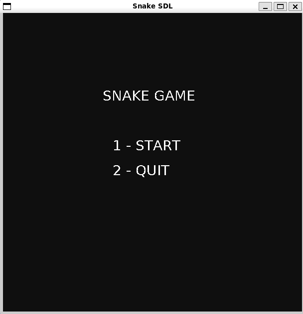
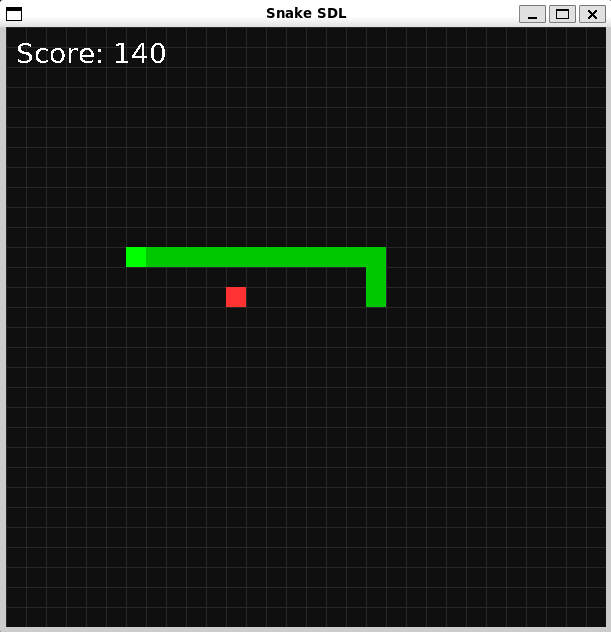
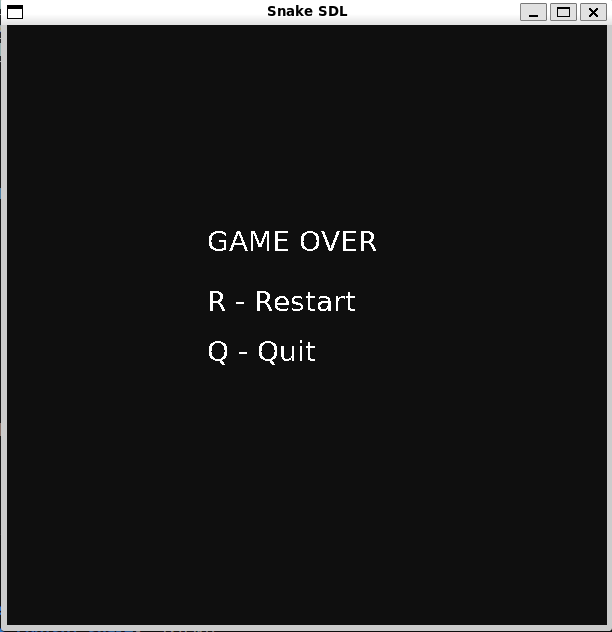

# SDL Snake Game 🐍

A classic Snake game built in **C++** using **SDL2** and **SDL_ttf**, featuring a fully functional menu, score display, speed increase, and restart/quit options. This project demonstrates real-time input handling, graphics rendering, and game loop management in C++.

---

## 🎮 Features

- Arrow key movement
- Snake grows as it eats food
- Food spawns randomly on a grid
- Score displayed on screen
- Snake speed increases as it eats
- Start menu with **Start** and **Quit**
- **Restart** and **Quit** options after Game Over
- Grid-based background for better visuals
- Simple and clean SDL2 graphics

---

## 🖼️ Screenshots

  
  
  

---

## 🛠️ Installation
**Requirements:** `SDL2` and `SDL2_ttf` installed on your system.

### Ubuntu / WSL:
```bash
sudo apt update
sudo apt install g++ libsdl2-dev libsdl2-ttf-dev
```

### Compile:
```bash
g++ snake.cpp -o snake -lSDL2 -lSDL2_ttf
```

### Run:
```bash
./snake
```

## ⌨️ Controls

### Menu
- `1` → Start  
- `2` → Quit  

### Playing
- Arrow keys → Move snake  

### Game Over
- `R` → Restart  
- `Q` → Quit  

---

## 🔧 How It Works

- **Game Loop:** Continuously updates the game state, handles input, and renders graphics.  
- **Snake Movement:** Stored as a vector of segments, with the head moving in the current direction and the body following.  
- **Collision Detection:** Checks for wall collisions and self-collision to end the game.  
- **Food System:** Randomly spawns food, increases snake size and score when eaten.  
- **Speed Scaling:** Game speed increases as the snake eats more food.  
- **Menu System:** Implements a start menu, game over screen, and restart/quit functionality.  

---

## 💡 Skills Demonstrated

- **C++ Programming:** Loops, enums, vectors, structures  
- **Game Development:** Game loop, collision detection, input handling  
- **SDL2 Graphics:** Rendering rectangles, background grid, colors  
- **SDL_ttf Text Rendering:** Score display and menu/game over text  
- **Project Organization:** Separate functions for readability and maintainability


## 📁 Project Structure
```bash
sdl_snake_game/
├─ snake.cpp          # Main game code
├─ README.md          # This file
└─ screenshots/       # Screenshots of the game
```

## 🚀 Future Upgrades

- Add sound effects `(SDL_mixer)`  
- High score saving  
- Multiple levels with obstacles  
- Animated snake sprites  
- Pause system  
- Mobile or web port  


## 📌 Author

Project by **Namada Simoni** 

GitHub: [Namada Jr](https://github.com/NAMADAJR)


